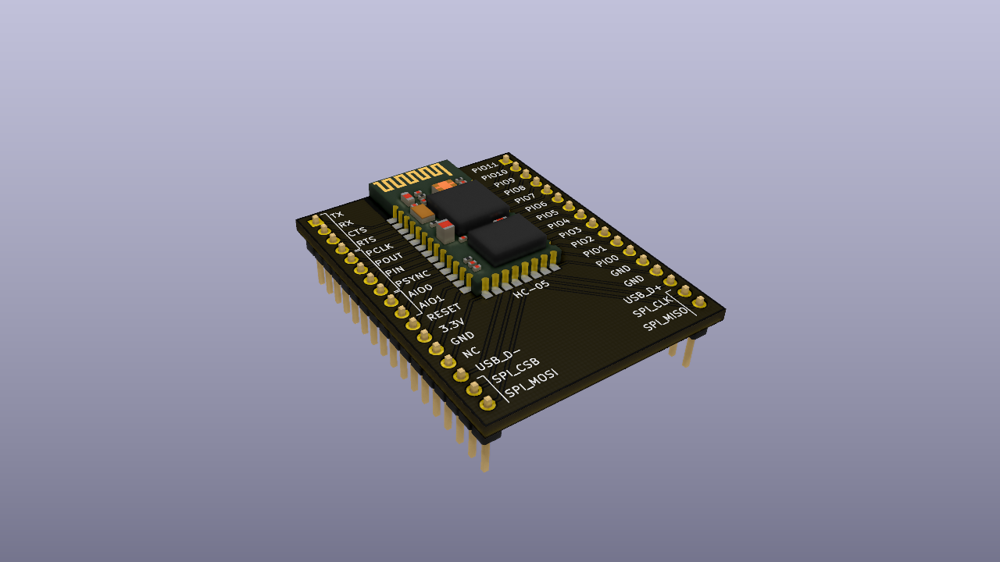

### HC-05 Development board

This repository contains simple PCB for HC-05 Bluetooth module. 

I wanted to play a little bit with updating firmware of the BC417. This will
allow use of HC-05 module without any external MCU as HC-05 has 12 digital IO,
two Analog pins, SPI, USB, UART and PCM (Pulse Code Modulation). 

Update: Unfortunately, didn't got to uploading. 
